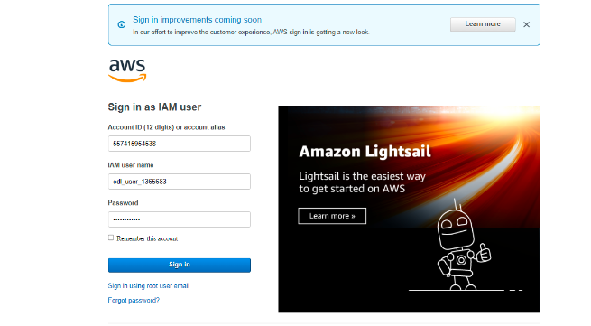
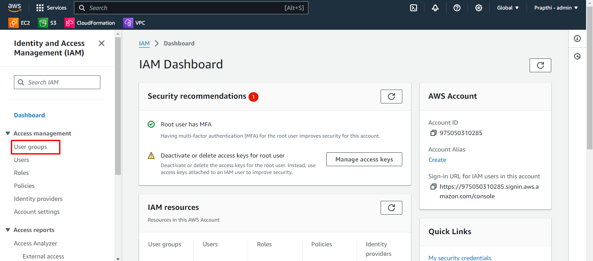

## Exercise 1: Creating Your IAM Group

 

In this lab you will learn about 
- how to create IAM group
- how to add IAM users to IAM group
- how to attach policy to IAM group

 

### TASK 1: Sign in to the AWS Management Console

 

1. Open browser of your choice, search for AWS Management Console and click on https://aws.amazon.com/

2. Sign in using your AWS account credentials.

 

 

### Task 2. Navigating to the Amazon IAM Service

 

Step 1: Once you login through the credential, you will directed to the AWS Console page.

 

 

Step 2: In the Search bar enter **IAM** and click on the **IAM**.
 

 

Step 3: You will be directing to the **IAM Dashboard**
 

 

Step 4: In the Navigation Panel click on **User groups** and the click on **Create group**
 

 

Step 5: Enter the group name **demogrp1**
 

 

Step 6: Followed by you can also add **IAM users** to the group by selecting the users as shown below and then scroll down.
 

 

Step 7: You can also attach policy to the group by selecting policy as shown below and then click on **Create group**
 

 

Step 8: Here the group is created.
 
 Click on **View group**
  

 

Step 9:Here you can see the attached **IAM users**
 

 

Step 10:Here you can see the attached **IAM policy**
 

 

Step 10: Now click the **User groups** in left panel. You will see the group **demogrp1** that you have created.
 

 

**Congratulations!** You have successfully created the IAM group.