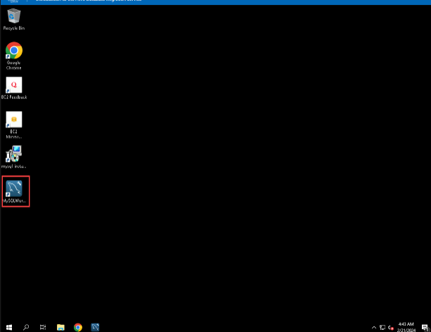
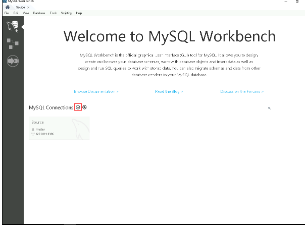
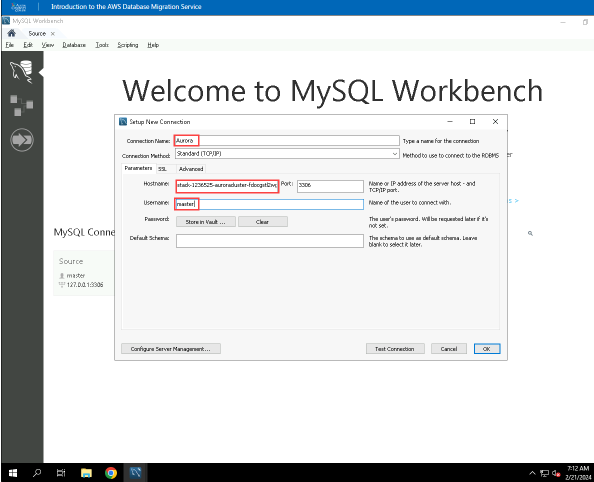
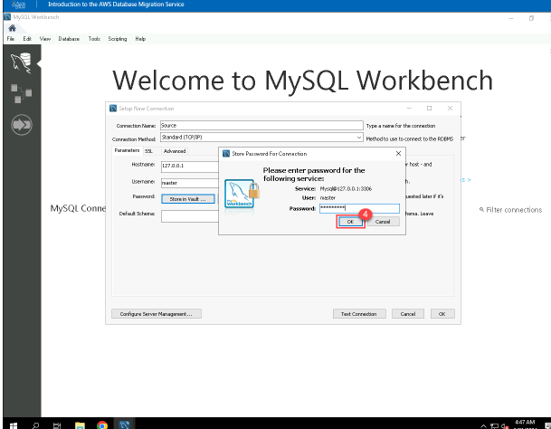
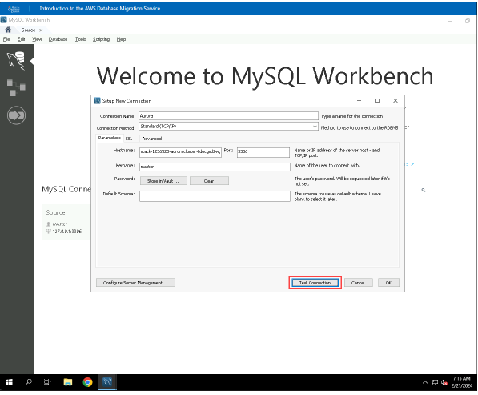
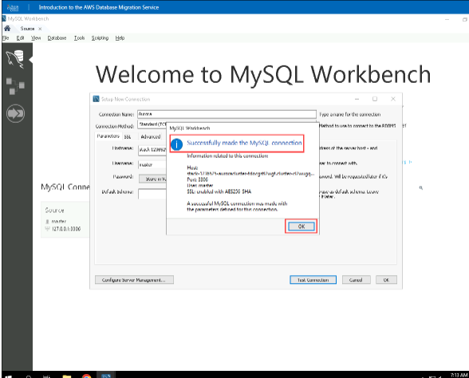
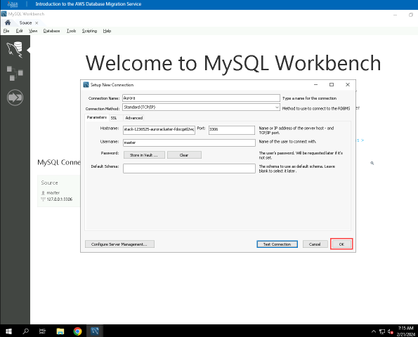
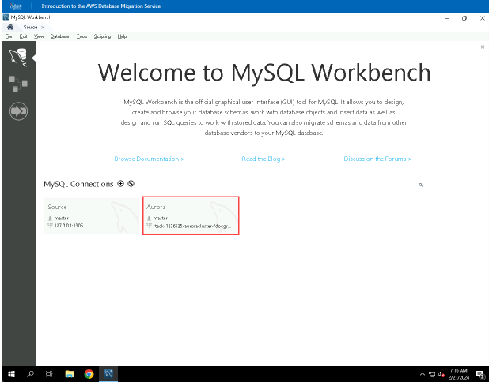
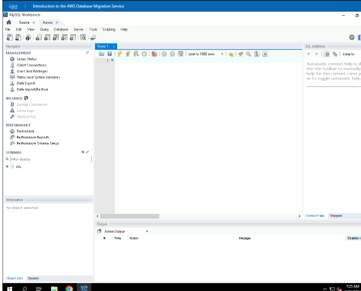

## Exercise 2: Use MySQL Workbench To Connect To Your Pre-Created RDS (Aurora) Instance.
In this exercise, you will be connecting your pre-created RDS (Aurora) Instance using the MySQL Workbench Application.

1. Open the **MySQL Workbench Application** on the LabVM, and on the MySQL Workbench homepage, click on the plus icon to add a new database connection.

 

 

2. Provide the below details in the opened Setup New Connection dialog box:

- For the Connection Name, enter **Aurora**.

- For the Username, enter **master**

- For the Hostname, enter cluster endpoint

-  For the Password, click on **Store in Vault** and enter , and then click **OK**.

 

 

3.  Click on **Test Connection** to verify whether the connection with MySQL is successful or not, and then click **OK**.

 

 

4. Click **OK** to save the connection details and verify that the connection is named **Aurora**.
   

 
 

5. Double click on connection **Aurora** to open a **Query Editor**.

 
 

6. In the Query Editor, execute the following query to verify that no data exists in your Aurora instance.
   
**Select * from mydb.employee;**

You should receive a message showing that mydb.employee does not exist.

