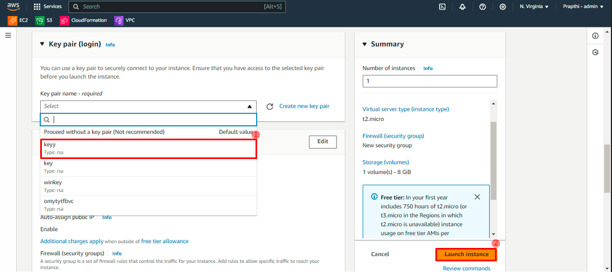
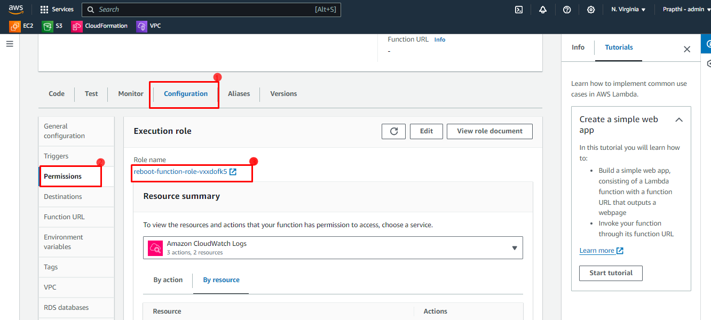
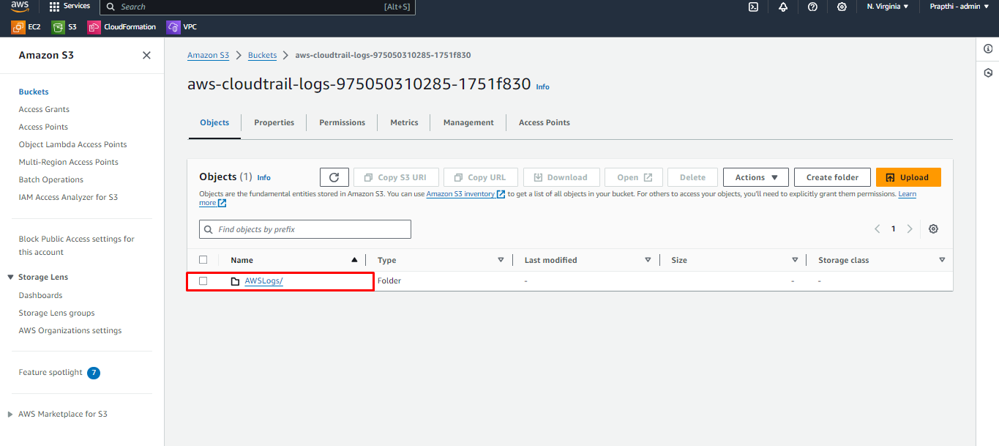

# <h2 align="middle"> Introduction to Amazon CloudWatch And CloudTrail </h2>

## Introduction
Let us have a brief introduction about what is cloudWatch and CloudTrail in AWS.

### CloudWatch
Amazon CloudWatch monitors your Amazon Web Services (AWS) resources and the applications you run on AWS in real time. CloudWatch collects monitoring and operational data in the form of logs, metrics, and events, and visualizes it using automated dashboards so you can get a unified view of your AWS resources, applications, and services that run in AWS and on-premises. You can also create alarms based on metric value thresholds you specify, or that can watch for anomalous metric behavior based on machine learning algorithms.
#### Features
- Metrics
- Dashboards
- Alarms
- Events
- Logs
- Amazon CloudWatch Pricing

### CloudTrail
AWS CloudTrail is service used along with  Amazon CloudWatch. It **Tracks User Activity and API Usage**. Actions taken by a user, role, or an AWS service are recorded as events in CloudTrail. Events include actions taken in the AWS Management Console, AWS Command Line Interface, and AWS SDKs and APIs.
 
 

### Go to the **AWS Management Console** to Sign in.
### Lets start
Follow the steps one by one to get hands on experience with with Cloudwatch and CloudTrail.

### Task 1: Sign in to the AWS Console
Open the browser and Search for **AWS Management Console**.
Click on **Sign in to the Console**
 

 
 

1. Sign in to the console by specifying **Account ID,Username and Password**.

 

2. After the Successfull log in you will be directing to **Console Home Page**.

Select the **region** you want to deploy.

 
 

#### Using the CloudWatch We can monitor all the services and applications in the AWS. Now let us consider **EC2 instance** and Check how CloudWatch Work.
 

#### Task 2:  First Create an EC2 instance 
1. Search for **EC2** instance in Search 
 

 
 

2. Enter the Name of the instance.
 

 
 

3. Select the **AMI**
 

 
 

4. Select the **Instance type**
 

 
 

5.Select the Key pair and Click on ***Lunch instance***
 

 
 

6.You can see the Created instance in the **Running state.**
 

 
 

### Task 3: Navigating through CloudWatch Console.

1. In the Console Home Page Search for **CloudWatch** and Click on it.

 
 

After performing the above action you will be directed to the  **CloudWatch Console Page.**

 
 

####  In the Navigation Panel there are different Features to Work with.
- Create Alarm
- Create Metrics
- Create a Dashboard
- View logs
- View events

 

### Task 4: Creating Metrics for EC2 instance
#### Metrics: 
Metrics are data about the performance of your systems. By default, many services provide free metrics for resources (such as Amazon EC2 instances, Amazon EBS volumes, and Amazon RDS DB instances). Amazon CloudWatch can load all the metrics in your account for search, graphing, and alarms.
Example, For EC2 instance CPU Utilization,Memory Utilization,Disk Space Utilization,Network In,Network Out are some of the metrics.
 

Click on  **All Metrics** to get into **Metrics Console page.**
1. Click on **Browse**->Select **EC2**

 
 

2. Click on **Per-Instance Metrics**
 

 

3. Enter any one among **dimension,metric,Instance ID,Resource Id** related to Service like here for EC2 instance WE can give Instance Id.
 

 
 

4. Select the Metric names that you want to monitor.
 Lets select CPUUtilization,NetworkIn and NetworkOut.
 

 
 

5. Click on ***Graphed metrics*** to set the Statistic and Period for metrics.
 

 
 

The time intervals like "1h", "3h","12h" ,"1d","1w" refer to the ***time range*** for which you want to view metrics and logs. For example, if you select "1h", you'll see data for the last 1 hour, while selecting "12h" will show data for the last 12 hours.

Select ***UTC timezone*** this refers to the standardized time zone used across the world as a reference time.

***Period*** refers to the time interval over which data points are aggregated and displayed on the graph. 

***Statistic***  to apply statistics to the data like AVG,Max,Min,Sum.

Here metrics will get updated for each ***5***min time period as mentioned in the period.
Here it will show data for last ***3*** hours.

We can also represent the metrics in different formats like ***Number,Line,Bar,Pie,Data table,Gauge***
 
 
 

## Task 5: Add to Dashboard
Amazon CloudWatch dashboards are customizable home pages in the CloudWatch console that you can use to monitor your resources in a single view, even those resources that are spread across different Regions.

From the metrics console we can directly add the Metrics to dashboard.

Click on ***Action*** ->***Add to dashboard*** 

 
 

Dashboard Configuration.
- Click on ***create***
- Click on **"Create new"**
- Enter the name **"EC2-dashboard"**
- Select ***Widget Type*** as **"Number"**
- Check the box
- Click on **Add to dashboard**

 

Here you can see the Metrics in dashborad.

 
 
 

## Task 6: Another way to create Dashboard 
In the Navigation Panel Click on ***Dashboard*** 

#### 1.***Custom Dashboard***

Follow the Steps for ***Custom Dashboard***  
- Click on ***Custom Dashboard*** 
- Click on **Create Dashboard** 

 
 

1. Enter the name **dashboard**

 

2. Add the following configuration.
- Select the ***Data sources type*** as **"CloudWatch"**
- Select the ***Data type*** as **"Metrics"**
- Select ***Widget type*** as **"Line"**
- Enter ***Next***

 
 

3. After Creating We can see it over Dashboard.
Click on **ec2-dashboard**
 

 
 

You can see the **metrics** here.

 

#### 2. **Automatic dashboard**
An automatic dashboard typically refers to a pre-built or templated dashboard provided by a software or platform. They typically come with predefined metrics, visualizations, and data connections.

#### Creating **Automatic dashboard**
- Click on ***Automatic dashboard*** 
- Select ***Any resources*** 
-  Select **EC2** 
 

 

 
 

## Task 7: Alarms
Cloudwatch alarm is used to monitor a single cloud watch metric or the result of Match expression using cloud watch metrics. Also, it sends out a notification based on the threshold we set for each service in the cloud watch alarm.

1. A **metric alarm** watches a single CloudWatch metric or the result of a math expression based on CloudWatch metrics.

The alarm performs one or more actions based on the value of the metric or expression relative to a threshold over a number of time periods. ***The action can be sending a notification to an Amazon SNS topic, performing an Amazon EC2 action or an Amazon EC2 Auto Scaling action, or creating an OpsItem or incident in Systems Manager.***
 

2. A **composite alarm** includes a rule expression that takes into account the alarm states of other alarms that you have created.

Composite alarms can send ***Amazon SNS notifications*** when they change state, and can create Systems Manager OpsItems or incidents when they go into ALARM state, but can't perform ***EC2 actions or Auto Scaling actions.***
 
 

### Now lets Create an Alarm for CPUUtilization of EC2 instance.
1. In the CloudWatch Console, click on ***In alarm*** in the Navigation panel.
2. Click on ***Create alarm***

 
 

3. Click on ***Select metric***

 

4. Select ***EC2***
 

 

5. Click on ***Per-Instance Metrics***
 

 

6. Go back to **EC2 Console**, Copy the EC2 **instance Id** of the EC2 instance created in the  start 
 

 
 

7. Paste the instance Id over the Search box in the metrics shown below.
 

 
 

8. Scroll down and Select the ***CPUUtilization*** and click on ***Select metric***.
 

 
 

9. We can see the ***Metric*** deatails like shown below.
 

 
 

The ***arrow mark*** shows the CPU utilization at that particular time.
***Statistic*** keep it as ***Average***
***Period 1min*** refers to If suppose CPU utilization reamains on a threshold or above threshold value for 1min then alram should get triggred.
 
 

10. Select the ***Threshold type*** as ***static***
- Select CPUUtilization ***Greater/Equal>= threshold***
-  Enter the Threshold value as ***18***
-  Click on ***Next***.

 

Once We set the **Threshold** we can see the **Red horizontal line** in the metric graph and the **Blue line** refers to the cuurent **CPUUtilization**.

***Once the Blue line meets or crosses the Red line alarm triggers***.
 
 

11. Configure actions
- Select ***In alarm*** 
- Click on **Crete new topic**
- Enter the name or it will take it by default 
- ***Enter the email addres*** to recieve ***SNS*** 
-  Click on ***Create new topic***.

 
 

After Creating new topic you will recieve a mail to your give email from AWS regarding your AWS Subscription Configuration and then Click on ***Confirm Subscription***.

 

After the Subscription Confirmed, Do not need to modify anything in Lambda, Auto Scaling action, EC2 action and System Manager action just Click on ***Next***. 

 
 

12. Enter the Alarm name -> Click on ***Next***
 

 
 

13.**Preview and create** shows the final overview of Alarm creation and then Click on ***Create alarm***
 

 
 

14.Click on **View alarm** In the CloudWatch Navigation panel **In alarm** ->Click on the ***ec2-alarm** that is your created alarm.

Here you can see the created alarm graph along with the description.
 

 
 

#### When the Blue **CPUUtilization line** meets or cross the Red **Threhold line** alarm triggers and you will recieve a SNS to your mail.
 

This is how you will get a mail.
 
 

 
 

In **In alarm** when the alarm triggers you will get notification like shown below.
 

 
 

Click on alarm name **ec2-alarm** there you can see CPUUtilization has crossed the Threshold and hence alarm triggered.
 

 
 
You can also add alarm to dashboard from here.
Goto **Action** ->Select **Add to dashboard**
 

 
 

**Select a dashboard** or create a new one by clicking on **Create new**-> Select the **Widget type** -> alarm name it will only take no need to give again -> Click on **Add to dashboard**
 

 

Click on **View dashboard**
 

 
 

Now you can see the alarm in dashboard and also you can save it by Clicking on **Save dashboard**
 

 
 

Now you can see the Saved dashboard **ec2-dashboard** in the Dashboard.
 
 

 
 

## Task 8: Events
Amazon CloudWatch **Events** delivers a near real-time stream of system events that describe changes in AWS resources. Using simple **rules** that you can quickly set up, you can match events and route them to one or more target functions or streams.

You can configure **rules** in Amazon CloudWatch Events to alert you to changes in AWS services.
 
#### Now lets create an CloudWatch event that is used to reboot an EC2 instance once in everyday.
So to achieve this We need an ***EC2 instance, Lambda function and an CloudWatch event.***
 

 

####  **Create a Lambda function**
 1. AWS Console -> Search **Lamda** 
  

 

2.Click on **Function** ->**Create function**
 

 

3. Create a lambda function
- Enter the function name **rebootofunction**
- Select the **Runtime ** as **Python 3.12**
- Select the Architecture **x86_64**
- For Execution role select **Create a new role with basic Lambda permission**
 

 

4. Now the **reboot function** is set. 
 

 

5. Replace the lambda function code with  reboot code.
 

 

6. Replace the ***your_instance_id_here*** with your Instance id.
 

 

Attach **EC2FullAccess** permission to lambda function.

7. Configuration ->permission ->Click on role name

 

8. Go to **Permission**
 - Click on **Attach policies**
 

 

9. Search for ***EC2FullAccess** ->Add permission.
 

 

10. Come back to the Lambda console page code section.
Click on **Deploy -> Test**
 

 

11. Enter the test name as **test-function**

 

12. Click on **Deploy**
 

 
 

13. Go back to CloudWatch Console 
Click on **Events-> Rules->Create Rule**

 
14.Enter Rule detail
- Rule ame as **rule**
- Select Rule type as **Schedule**  
- Click on **Continue to create rule**

 

 14.**Define schedule** 
 - Select 2nd option.
 - Value  **1** refers Lambda function triggers once in everyday.
 - Click on **Next**

 

15. **Select targets.**
- For tafget types select **AWS service** 
- Select the target as **Lambda function** 
- For function select **Reboot**
- Click on **Next**
 

 

16. Click on **Next**
 

 

17. Click on **Create Rule**

 

18. Go back to lambda function ->Click on **Monitor** 
You can see the **CloudWatch Metrics**. Data will be populated as time passes.
 

 

 

19. Click on **View CloudWatch logs**
It will take you to the **CloudWatch Log groups**. You can see some logs. Click on **logs**
 

 
Here you can see all the **Log events**

 
 

## 5. CloudTrail
AWS CloudTrail is an AWS service that helps you enable operational and risk auditing, governance, and compliance of your AWS account. Actions taken by a user, role, or an AWS service are recorded as events in CloudTrail. 
- Event history – The Event history provides a viewable, searchable, downloadable, and immutable record of the past 90 days of management events in an AWS Region.
- Trails – Trails capture a record of AWS activities, delivering and storing these events in an **Amazon S3 bucket**, with optional delivery to **CloudWatch Logs and Amazon EventBridge**.
 

 #### Task 9: **CloudTrail** Console page.
 

 

### Lets create a **Trail.**
 

1. Click on **Trail** -> **Create Trail**
 

 

2. **Choose trail attributes**
- Enter Trail name as **Demotrail** 
- Click on **Create new S3 bucket**
- Bucket name it will take by default if you select ***Create new S3 bucket***

 

3. Enter the **Keyname** as **Demokey** and select the check boxes as shown below.
 

 

4. If you select **New** log group then the name will be take by default and select the checkboxes as shown below.
 

 

5. Click on **Next**
 

 

#### 2. Choose Log events
 

- **Management events**: Provide information about management operations that are performed on resources in your AWS account.
Example: ***AWS Identity and Access Management AttachRolePolicy API operations***
 

- **Data events**: Data events provide information about the resource operation performed on or in a resource.
Example: ***Amazon S3 object-level API activity*** 
 

- **Insights events**: CloudTrail Insights events capture unusual API call rate or error rate activity in your AWS account.
Insights events are logged to the destination of your trail.
 

 

1. Check **Read** and **Write**
Choose **S3** as the source of data events to log ->Select **Log All events**
 

 
2. Click on **Next**
 

 

3. Click on **Create Trail**
 

 

4. **Trail has created**
 

 
 

5. Now search for **S3** in search box.

 
6.This the created **S3 destination bucket**. Click on the bucket.
 

 

 

 

7. You can see the **CloudTrail** file here.
 

 

#### Now again go back to the CloudWatch Console
You can see the Log groups is created.
Click on it.
 

.
 

You can see the Log streams of the Log group.
Click any one of them to see the Log events.
 

 

These are all the recent events performed on the resources.
 

 

#### Event history
Event history shows you the last 90 days of management events.
 

 
 

## Task 10: Log groups
 Amazon CloudWatch Logs to monitor, store, and access your log files from Amazon Elastic Compute Cloud (Amazon EC2) instances, AWS CloudTrail, Route 53, and other sources.
 - CloudWatch Logs enables you to centralize the logs from all of your systems, applications, and AWS services that you use, in a single, highly scalable service.

 As soon as we create CloudWatch events, Trails it will get stored under **Log groups**
 So that you can easily monitor the resources by just clicking on it.

 **Go to the CloudWatch Console -> Click on log -> Log groups.**
  

 Here you can see the previously created events and trails.
 Click on the **reboot event**.

 

A **log stream** is a sequence of log events that share the same source. Each separate source of logs in CloudWatch Logs makes up a separate log stream.
You can see the streams here. Click any one of it.

 

**Log events**: These are all the record of some activity recorded by the application or resource being monitored 

 
 

##  Amazon CloudWatch Pricing
CloudWatch pricing in general has no upfront commitment or minimum fee. You pay only for what you use Pricing for Network Monitor has the following two components:

- an hourly per monitored resource fee, and

- CloudWatch metrics fees.
 

 CloudWatch offers many different products. Let's see a quick recap of all of them and their basic idea of pricing

 **CloudWatch Metrics**: CloudWatch Metrics is sending application or service metrics to CloudWatch. The standard metrics (e.g. number of errors in Lambda for each minute) are free. Custom metrics are priced by the number of metrics you send to CloudWatch. Metrics resolution also costs differently.

**CloudWatch Logs**: AWS CloudWatch log data pricing is based on the amount of log data you ingest, store, and analyze. AWS CloudWatch provides a free tier of 5 GB per month for ingested logs, with charges applied after that.

**CloudWatch Alarms**: AWS CloudWatch alarm pricing is based on the number of alarms you create and manage, along with the notification and data storage costs. AWS CloudWatch provides a free tier of 10 alarms per month, with charges applied after that.

**CloudWatch Dashboards**: AWS CloudWatch dashboard pricing is based on the number of dashboards you create and the data visualization costs. AWS CloudWatch provides a free tier of 3 dashboards per month, with charges applied after that.
 
## AWS CloudWatch Free Tier
One of the great benefits of using AWS CloudWatch is the availability of the ***free tier***. The free tier allows users to explore CloudWatch's various products and services without incurring any costs.
Each product under CloudWatch has its free tier offering. 

 

Congratulations! You have successfully Completed the **Amazon CloudWatch and CloudTrail** lab.
